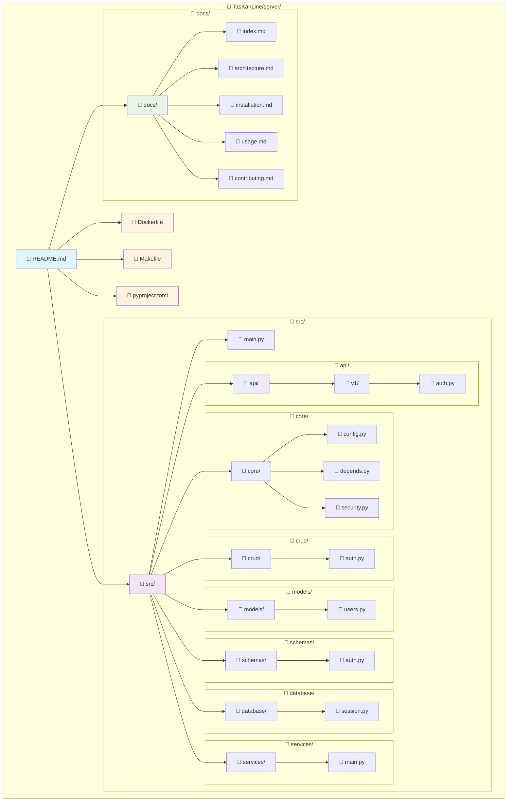
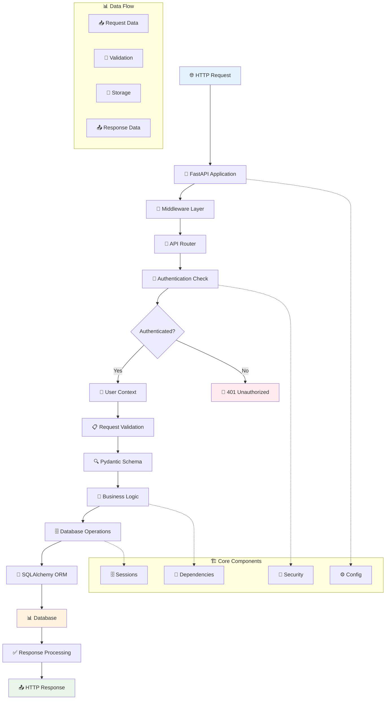
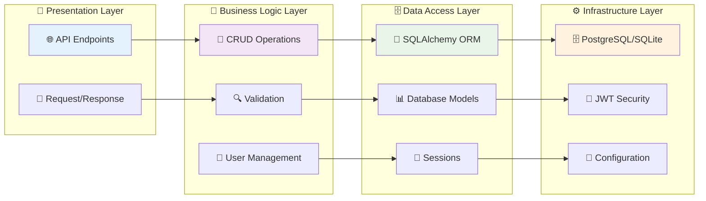
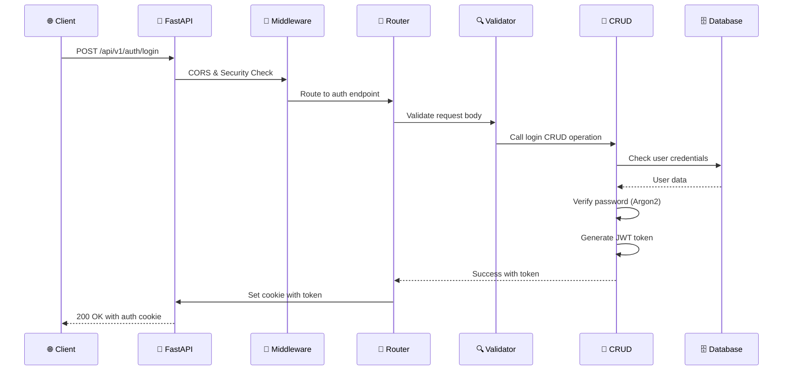

# 🏗️ Архитектура и структура проекта

## 📋 Обзор архитектуры

**TasKanLine Backend** построен по принципам **Clean Architecture** с четким разделением слоев ответственности. Это обеспечивает масштабируемость, тестируемость и легкость поддержки кода.

### 🎯 Основные принципы

- **🔄 Dependency Injection** — все зависимости передаются через конструкторы
- **🗂️ Разделение ответственности** — каждый модуль выполняет свою задачу
- **⚡ Асинхронность** — все операции с БД выполняются асинхронно
- **🛡️ Типизация** — строгая типизация на всех уровнях
- **🔧 Конфигурируемость** — гибкая настройка окружения

## 📁 Структура проекта

### 📂 Основные каталоги и файлы

```
📁 TasKanLine/server/
├── 📁 src/                          # Основной исходный код
│   ├── 📁 api/                      # API роуты и контроллеры
│   │   ├── 📁 v1/                   # API версии 1
│   │   │   ├── 📄 auth.py          # Эндпоинты аутентификации
│   │   │   └── 📄 __init__.py      # Инициализация модуля
│   │   └── 📄 __init__.py          # Инициализация API
│   ├── 📁 core/                     # Основная конфигурация
│   │   ├── 📄 config.py            # Настройки приложения
│   │   ├── 📄 depends.py           # Зависимости FastAPI
│   │   └── 📄 security.py          # Настройка безопасности JWT
│   ├── 📁 crud/                     # Бизнес-логика работы с данными
│   │   ├── 📄 auth.py              # CRUD операции для пользователей
│   │   └── 📄 __init__.py          # Инициализация CRUD
│   ├── 📁 database/                 # Работа с базой данных
│   │   └── 📄 session.py           # Настройка SQLAlchemy сессий
│   ├── 📁 models/                   # SQLAlchemy модели данных
│   │   ├── 📄 users.py             # Модели User и UserProfile
│   │   └── 📄 __init__.py          # Инициализация моделей
│   ├── 📁 schemas/                  # Pydantic схемы валидации
│   │   ├── 📄 auth.py              # Схемы для аутентификации
│   │   └── 📄 __init__.py          # Инициализация схем
│   ├── 📁 services/                 # Сервисный слой (готов к расширению)
│   │   └── 📄 main.py              # Основные сервисы
│   └── 📄 main.py                   # Точка входа в приложение
├── 📁 docs/                         # Документация проекта
├── 📁 database/                     # Файлы баз данных (SQLite)
├── 📄 .env.example                  # Пример конфигурации окружения
├── 📄 .gitignore                    # Игнорируемые файлы Git
├── 📄 .python-version               # Версия Python для uv
├── 📄 Dockerfile                    # Инструкция сборки Docker образа
├── 📄 Makefile                      # Команды управления проектом
├── 📄 pyproject.toml               # Метаданные проекта и зависимости
├── 📄 requirements.txt             # Зависимости для Docker
├── 📄 README.md                     # Основная документация
└── 📄 uv.lock                      # Заблокированные зависимости uv
```

### 📝 Назначение основных файлов

| Файл | Назначение | Ключевая функциональность |
|------|------------|---------------------------|
| **`src/main.py`** | Точка входа | Создание FastAPI приложения, настройка middleware |
| **`src/core/config.py`** | Конфигурация | Настройки БД, JWT, CORS, переменные окружения |
| **`src/core/security.py`** | Безопасность | Настройка AuthX, JWT токены, куки |
| **`src/core/depends.py`** | Зависимости | Сессии БД, аутентификация пользователей |
| **`src/database/session.py`** | БД сессии | SQLAlchemy engine, сессии, подключение |
| **`src/models/users.py`** | Модели данных | User, UserProfile модели SQLAlchemy |
| **`src/schemas/auth.py`** | Схемы | Pydantic модели для валидации данных |
| **`src/crud/auth.py`** | Бизнес-логика | CRUD операции для пользователей |
| **`src/api/v1/auth.py`** | API роуты | Эндпоинты /signup, /login, /protected |

## 🎨 Визуализация архитектуры

### 📊 Интерактивная диаграмма репозитория



### 🔄 Flow Diagram архитектуры приложения



### 🎯 Архитектурные слои



## 🔄 Поток данных в приложении

### 📋 Типичный запрос аутентификации



## 🎨 Принципы проектирования

### 🏛️ SOLID принципы в проекте

1. **S - Single Responsibility**: Каждый класс выполняет одну задачу
2. **O - Open/Closed**: Готов к расширению без модификации
3. **L - Liskov Substitution**: Модели корректно наследуются
4. **I - Interface Segregation**: Четкое разделение интерфейсов
5. **D - Dependency Inversion**: Зависимости инжектируются

### 🔄 Паттерны проектирования

- **🏭 Repository Pattern** — CRUD операции инкапсулированы
- **🔧 Dependency Injection** — зависимости передаются через FastAPI
- **🎭 Factory Pattern** — сессии БД создаются через фабрики
- **📝 Strategy Pattern** — разные БД (PostgreSQL/SQLite)

## 🚀 Масштабирование и расширение

### 📈 Готовность к росту

Архитектура проекта готова к:

- **📊 Новым модулям** — задачи, проекты, команды
- **🔌 Микросервисам** — выделение отдельных сервисов
- **🗄️ Разным БД** — Redis, MongoDB, другие SQL
- **🌐 Load Balancing** — горизонтальное масштабирование
- **📦 Caching** — многоуровневое кеширование

### 🎯 Следующие шаги развития

1. **📋 Task Management** — CRUD для задач
2. **👥 Team Collaboration** — команды и роли
3. **📊 Analytics** — отчеты и статистика
4. **🔔 Notifications** — система уведомлений
5. **🌐 API v2** — следующая версия API

---

**💡 Совет:** Изучите диаграммы выше, чтобы лучше понять, как компоненты взаимодействуют друг с другом. Это поможет вам эффективно работать с проектом! 🚀