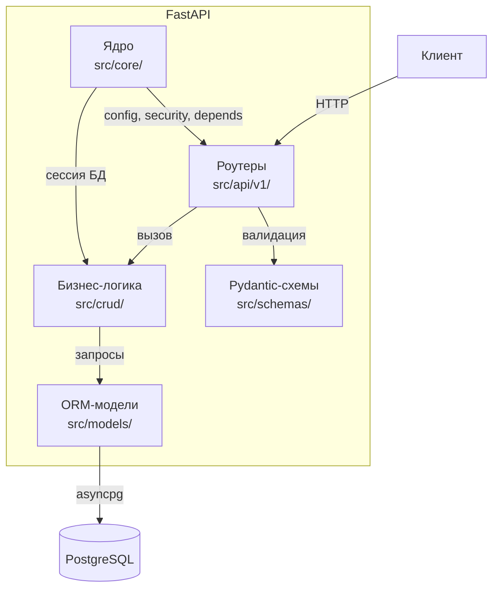
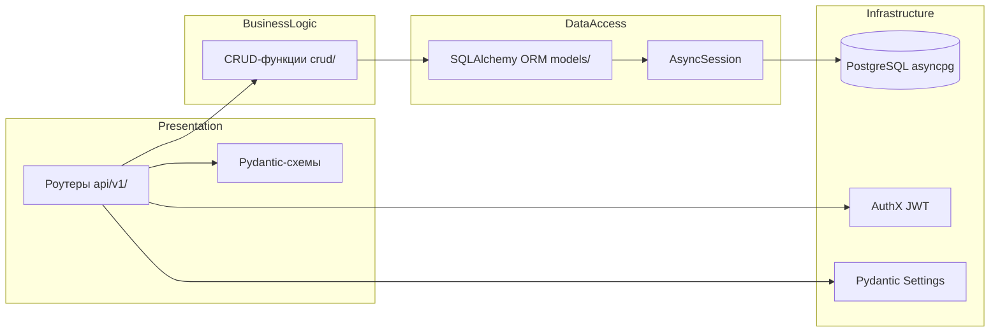
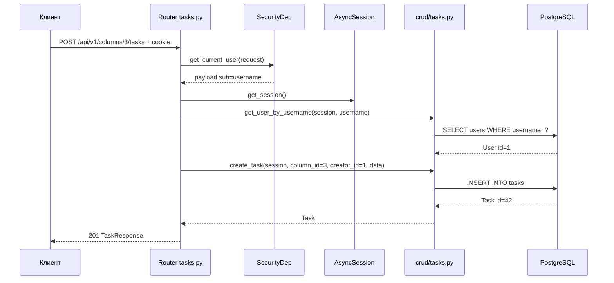
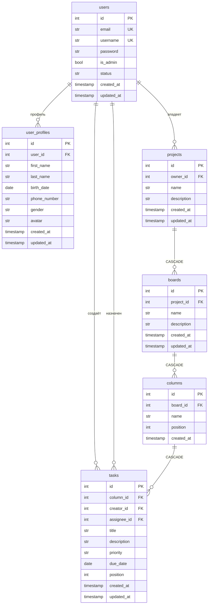
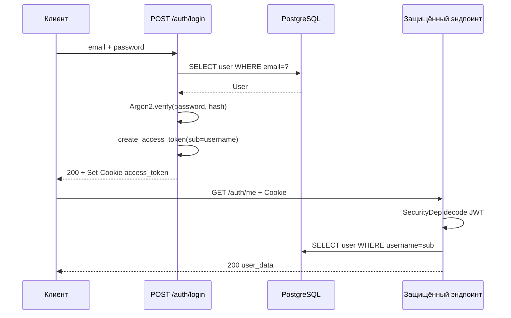

# Архитектура TasKanLine Backend

## Содержание

- [Общая архитектура](#общая-архитектура)
- [Структура директорий](#структура-директорий)
- [Слои приложения](#слои-приложения)
- [Поток запроса](#поток-запроса)
- [Модель данных](#модель-данных)
- [Аутентификация](#аутентификация)
- [Регистрация роутеров](#регистрация-роутеров)

---

## Общая архитектура

Монолитное приложение с разделением на слои: роутеры → CRUD → SQLAlchemy ORM → PostgreSQL.


```mermaid
graph TB
    Client[Клиент]

    subgraph FastAPI
        Router[Роутеры\nsrc/api/v1/]
        CRUD[Бизнес-логика\nsrc/crud/]
        Models[ORM-модели\nsrc/models/]
        Schemas[Pydantic-схемы\nsrc/schemas/]
        Core[Ядро\nsrc/core/]
    end

    DB[(PostgreSQL)]

    Client -->|HTTP| Router
    Router -->|валидация| Schemas
    Router -->|вызов| CRUD
    CRUD -->|запросы| Models
    Models -->|asyncpg| DB
    Core -->|config, security, depends| Router
    Core -->|сессия БД| CRUD
```

## Структура директорий

```
src/
├── main.py                  # Точка входа: FastAPI app, CORS, роутеры
├── api/
│   ├── __init__.py          # Префикс /api, объединение роутеров v1
│   └── v1/
│       ├── __init__.py      # Сборка роутеров v1
│       ├── auth.py          # /auth — регистрация, вход, выход, профиль
│       ├── projects.py      # /projects — CRUD проектов
│       ├── boards.py        # /projects/{id}/boards, /boards/{id}
│       ├── columns.py       # /boards/{id}/columns, /columns/{id}
│       └── tasks.py         # /columns/{id}/tasks, /tasks/{id}
├── core/
│   ├── config.py            # Pydantic Settings (CORE__ и DB__ переменные)
│   ├── database.py          # SQLAlchemy engine, Base, get_session
│   ├── depends.py           # AsyncSessionDep, SecurityDep (FastAPI зависимости)
│   └── security.py          # AuthX конфигурация (JWT cookie + header)
├── crud/
│   ├── auth.py              # CRUD пользователей и профилей
│   └── tasks.py             # CRUD проектов, досок, колонок, задач
├── models/
│   ├── __init__.py          # Импорт всех моделей (нужен Alembic)
│   ├── users.py             # User, UserProfile
│   └── tasks.py             # Project, Board, Column, Task
├── schemas/
│   ├── auth.py              # UserCreate, UserLogin, UserResponse, UserModel
│   └── tasks.py             # ProjectCreate/Response, BoardCreate/Response,
│                            # ColumnCreate/Response, TaskCreate/Update/Response/Move
└── services/                # Сервисный слой (зарезервирован, пока пустой)
```

## Слои приложения


```mermaid
graph LR
    subgraph Presentation
        A[Роутеры api/v1/]
        B[Pydantic-схемы]
    end

    subgraph BusinessLogic
        C[CRUD-функции crud/]
    end

    subgraph DataAccess
        D[SQLAlchemy ORM models/]
        E[AsyncSession]
    end

    subgraph Infrastructure
        F[(PostgreSQL asyncpg)]
        G[AuthX JWT]
        H[Pydantic Settings]
    end

    A --> B
    A --> C
    C --> D
    D --> E
    E --> F
    A --> G
    A --> H
```

## Поток запроса

Пример: создание задачи `POST /api/v1/columns/{id}/tasks`


```mermaid
sequenceDiagram
    participant C as Клиент
    participant R as Router tasks.py
    participant S as SecurityDep
    participant DB as AsyncSession
    participant CRUD as crud/tasks.py
    participant PG as PostgreSQL

    C->>R: POST /api/v1/columns/3/tasks + cookie
    R->>S: get_current_user(request)
    S-->>R: payload sub=username
    R->>DB: get_session()
    R->>CRUD: get_user_by_username(session, username)
    CRUD->>PG: SELECT users WHERE username=?
    PG-->>CRUD: User id=1
    R->>CRUD: create_task(session, column_id=3, creator_id=1, data)
    CRUD->>PG: INSERT INTO tasks
    PG-->>CRUD: Task id=42
    CRUD-->>R: Task
    R-->>C: 201 TaskResponse
```

## Модель данных


```mermaid
erDiagram
    users {
        int id PK
        str email UK
        str username UK
        str password
        bool is_admin
        str status
        timestamp created_at
        timestamp updated_at
    }

    user_profiles {
        int id PK
        int user_id FK
        str first_name
        str last_name
        date birth_date
        str phone_number
        str gender
        str avatar
        timestamp created_at
        timestamp updated_at
    }

    projects {
        int id PK
        int owner_id FK
        str name
        str description
        timestamp created_at
        timestamp updated_at
    }

    boards {
        int id PK
        int project_id FK
        str name
        str description
        timestamp created_at
        timestamp updated_at
    }

    columns {
        int id PK
        int board_id FK
        str name
        int position
        timestamp created_at
    }

    tasks {
        int id PK
        int column_id FK
        int creator_id FK
        int assignee_id FK
        str title
        str description
        str priority
        date due_date
        int position
        timestamp created_at
        timestamp updated_at
    }

    users ||--o{ user_profiles : "профиль"
    users ||--o{ projects : "владеет"
    users ||--o{ tasks : "создаёт"
    users ||--o{ tasks : "назначен"
    projects ||--o{ boards : "CASCADE"
    boards ||--o{ columns : "CASCADE"
    columns ||--o{ tasks : "CASCADE"
```

## Аутентификация

JWT-токен подписывается секретом `CORE__JWT_SECRET_KEY`. Токен хранится в cookie `access_token` (устанавливается при логине, удаляется при логауте). Также принимается через заголовок `Authorization: Bearer <token>`.

Декодирование выполняется в `SecurityDep` (`src/core/depends.py`). Полезная нагрузка токена содержит `sub` (username), `email`, `username`.


```mermaid
sequenceDiagram
    participant C as Клиент
    participant A as POST /auth/login
    participant DB as PostgreSQL
    participant P as Защищённый эндпоинт

    C->>A: email + password
    A->>DB: SELECT user WHERE email=?
    DB-->>A: User
    A->>A: Argon2.verify(password, hash)
    A->>A: create_access_token(sub=username)
    A-->>C: 200 + Set-Cookie access_token

    C->>P: GET /auth/me + Cookie
    P->>P: SecurityDep decode JWT
    P->>DB: SELECT user WHERE username=sub
    P-->>C: 200 user_data
```

## Регистрация роутеров

```
src/api/v1/__init__.py  →  собирает: auth, projects, boards, columns, tasks
src/api/__init__.py     →  добавляет prefix="/api", включает v1-роутер
src/main.py             →  app.include_router(api_router)
```

Итоговый базовый путь всех эндпоинтов: `/api/v1/`
