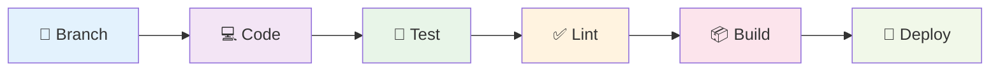

# 🤝 Вклад в проект

## 🎯 Добро пожаловать в команду!

Мы рады приветствовать вас в сообществе **TasKanLine**! Этот гайд поможет вам начать вклад в развитие проекта.

## 🚀 Как начать

### 📋 Шаг 1: Изучение проекта

1. 📖 **Прочитайте документацию**
   - [Введение](index.md) — обзор проекта
   - [Архитектура](architecture.md) — структура проекта
   - [Использование](usage.md) — работа с API

2. 🍴 **Скопируйте репозиторий**
   ```bash
   git clone <repository-url>
   cd TasKanLine/server
   ```

3. 🛠️ **Настройте окружение**
   ```bash
   # Установите зависимости
   make dev
   
   # Создайте .env файл
   cp .env.example .env
   ```

4. 🧪 **Запустите проект**
   ```bash
   uv run src/main.py
   ```

### 📋 Шаг 2: Выбор задачи

1. 🔍 **Изучите Issues**
   - Откройте раздел [Issues](https://github.com/your-repo/issues)
   - Найдите задачи с меткой `good first issue`

2. 🏷️ **Метки приоритета**
   - 🔥 `high` — критические ошибки
   - 🟡 `medium` — важные улучшения
   - 🟢 `low` — мелкие правки

3. 💬 **Обсудите задачу**
   - Оставьте комментарий в Issue
   - Уточните детали у команды

## 🛠️ Процесс разработки

### 📋 Ветвление и коммиты

#### 🌳 Стратегия ветвления

```bash
# Создайте ветку для своей задачи
git checkout -b feature/your-feature-name

# Или для исправления ошибки
git checkout -b fix/bug-description
```

#### 📝 Правила именования веток

- `feature/` — новая функциональность
- `fix/` — исправление ошибок
- `docs/` — документация
- `refactor/` — рефакторинг кода
- `test/` — тесты

#### ✨ Стиль коммитов

Используйте [Conventional Commits](https://www.conventionalcommits.org/):

```bash
# Функциональность
git commit -m "feat: add user profile endpoint"

# Исправление
git commit -m "fix: resolve authentication token issue"

# Документация
git commit -m "docs: update API documentation"

# Тесты
git commit -m "test: add unit tests for user service"
```

### 🧪 Разработка и тестирование

#### 🔄 Цикл разработки



#### 🧪 Запуск тестов

```bash
# Запуск всех тестов
make test

# Запуск конкретного теста
pytest tests/test_auth.py

# Запуск с покрытием
pytest --cov=src tests/
```

#### 🔍 Проверка кода

```bash
# Форматирование кода
make format

# Проверка линтинга
make lint

# Проверка типов
make typecheck
```

### 📝 Pull Request

#### 🚀 Создание Pull Request

1. 📤 **Отправьте изменения**
   ```bash
   git push origin feature/your-feature-name
   ```

2. 🌐 **Создайте PR**
   - Откройте GitHub
   - Нажмите "New Pull Request"
   - Выберите свою ветку

3. 📋 **Заполните шаблон PR**

```markdown
## 📋 Описание
Краткое описание изменений

## 🎯 Тип изменений
- [ ] 🐛 Bug fix
- [ ] ✨ New feature
- [ ] 💡 Breaking change
- [ ] 📝 Documentation update

## 🧪 Тестирование
- [ ] Добавлены тесты
- [ ] Все тесты проходят
- [ ] Ручное тестирование выполнено

## 📸 Скриншоты
(если применимо)

## 🔗 Связанные Issues
Closes #123
```

#### ✅ Требования к PR

- ✅ **Тесты** — все тесты должны проходить
- ✅ **Линтинг** — код должен соответствовать стандартам
- ✅ **Документация** — обновлена при необходимости
- ✅ **Совместимость** — не ломает существующий функционал

## 📚 Стандарты кода

### 🐍 Python стандарты

#### 🎯 Стиль кода (PEP 8)

```python
# ✅ Хорошо
class UserService:
    def create_user(self, email: str, password: str) -> User:
        """Create a new user with email and password."""
        if not self.validate_email(email):
            raise ValueError("Invalid email format")
        
        hashed_password = self.hash_password(password)
        return self.user_repository.create(email, hashed_password)

# ❌ Плохо
class userservice:
    def createuser(self, email, password):
        if not self.validateemail(email):
            raise ValueError("Invalid email")
        return self.userrepository.create(email, self.hashpassword(password))
```

#### 📝 Документация

```python
def authenticate_user(email: str, password: str) -> Optional[User]:
    """
    Authenticate a user with email and password.
    
    Args:
        email: User's email address
        password: User's plain text password
        
    Returns:
        User object if authentication successful, None otherwise
        
    Raises:
        ValueError: If email format is invalid
        DatabaseError: If database operation fails
        
    Example:
        >>> user = authenticate_user("user@example.com", "password123")
        >>> if user:
        ...     print(f"Welcome {user.email}")
    """
```

#### 🏷️ Типизация

```python
# ✅ С типизацией
from typing import Optional, List
from uuid import UUID

def get_user_tasks(user_id: UUID, status: Optional[str] = None) -> List[Task]:
    """Get tasks for a specific user with optional status filter."""
    pass

# ❌ Без типизации
def get_user_tasks(user_id, status=None):
    pass
```

### 📝 Стандарты документации

#### 📖 README.md

- 📋 Актуальная информация
- 🚀 Инструкции по установке
- 💡 Примеры использования
- 🤝 Информация для контрибьюторов

#### 📚 Кодовая документация

```python
# Модуль: src/services/user.py
"""
User service module.

This module provides business logic for user management operations.
"""

class UserService:
    """Service for managing user operations."""
    
    def __init__(self, user_repository: UserRepository):
        """
        Initialize UserService with repository.
        
        Args:
            user_repository: Repository for user data operations
        """
        self._repository = user_repository
```

## 🧪 Тестирование

### 📋 Виды тестов

#### 🧪 Unit тесты

```python
import pytest
from unittest.mock import Mock, patch

class TestUserService:
    def setup_method(self):
        """Setup test environment."""
        self.mock_repository = Mock()
        self.service = UserService(self.mock_repository)
    
    def test_create_user_success(self):
        """Test successful user creation."""
        # Arrange
        email = "test@example.com"
        password = "SecurePass123!"
        
        # Act
        result = self.service.create_user(email, password)
        
        # Assert
        assert result.email == email
        self.mock_repository.create.assert_called_once()
```

#### 🔗 Integration тесты

```python
import pytest
from httpx import AsyncClient
from src.main import app

@pytest.mark.asyncio
async def test_user_registration_flow():
    """Test complete user registration flow."""
    async with AsyncClient(app=app, base_url="http://test") as client:
        # Register user
        response = await client.post(
            "/api/v1/auth/signup",
            json={"email": "test@example.com", "password": "SecurePass123!"}
        )
        assert response.status_code == 201
        
        # Login user
        response = await client.post(
            "/api/v1/auth/login",
            json={"email": "test@example.com", "password": "SecurePass123!"}
        )
        assert response.status_code == 200
        
        # Access protected endpoint
        response = await client.get("/api/v1/auth/protected")
        assert response.status_code == 200
```

### 📊 Покрытие кода

```bash
# Проверка покрытия
pytest --cov=src --cov-report=html

# Минимальное требование: 80%
```

## 🔄 Рабочий процесс

### 📅 Ежедневные задачи

1. 🌅 **Утро**
   - Проверьте новые Issues
   - Обновите свою ветку
   - Просмотрите PR команды

2. 🌞 **День**
   - Разработка по своей задаче
   - Тестирование изменений
   - Code review для коллег

3. 🌆 **Вечер**
   - Создайте коммиты
   - Отправьте изменения
   - Обновите статус задачи

### 📋 Еженедельные задачи

1. 📊 **Понедельник** — планирование недели
2. 🧪 **Среда** — рефакторинг и оптимизация
3. 📝 **Пятница** — обновление документации

## 🎯 Направления развития

### 📋 Приоритетные задачи

#### 🔥 Высокий приоритет

- 📋 **Task Management** — CRUD для задач
- 👥 **User Profiles** — профили пользователей
- 🔐 **Security** — улучшение безопасности

#### 🟡 Средний приоритет

- 📊 **Analytics** — аналитика и отчеты
- 🔔 **Notifications** — система уведомлений
- 🌐 **API v2** — следующая версия API

#### 🟢 Низкий приоритет

- 🎨 **UI/UX** — улучшение интерфейса
- 📦 **Plugins** — система плагинов
- 🌍 **Internationalization** — мультиязычность

### 🚀 Новые возможности

#### 💡 Идеи для развития

1. **🤖 AI Assistant** — умный помощник
2. **📱 Mobile App** — мобильное приложение
3. **🔌 Integrations** — интеграции с другими сервисами
4. **📊 Advanced Analytics** — продвинутая аналитика
5. **🌐 Real-time** — real-time обновления

## 🏆 Награды и признание

### 🎖️ Типы вклада

- 💻 **Код** — разработка функционала
- 📝 **Документация** — улучшение документации
- 🐛 **Bug Reports** — сообщение об ошибках
- 💡 **Ideas** — предложения по улучшению
- 🧪 **Тесты** — написание тестов
- 🎨 **Design** — улучшение дизайна

### 🌟 Признание вклада

- 📋 **Contributors** — список контрибьюторов
- 🏆 **Hall of Fame** — лучшие контрибьюторы
- 🎖️ **Badges** — значки достижений
- 📢 **Shoutouts** — упоминания в релизах

## 📞 Связь и поддержка

### 💬 Каналы коммуникации

- 💬 **Discord** — общение в реальном времени
- 📧 **Email** — официальная переписка
- 🐛 **GitHub Issues** — технические вопросы
- 📱 **Telegram** — быстрые вопросы

### 🆘 Получение помощи

1. 📋 **Изучите документацию**
2. 🔍 **Поищите в Issues**
3. 💬 **Спросите в Discord**
4. 📧 **Напишите на email**

### 📝 Кодекс поведения

- 🤗 **Уважайте** других участников
- 💡 **Будьте** конструктивными
- 🎯 **Фокусируйтесь** на решении проблем
- 🌟 **Помогайте** новичкам
- 📚 **Учитесь** у опытных

---

## 🎉 Начните сегодня!

Готовы внести свой вклад? Вот что нужно сделать:

1. 🍴 **Fork** репозиторий
2. 🌿 **Создайте** ветку
3. 💻 **Напишите** код
4. 🧪 **Протестируйте**
5. 📤 **Отправьте** PR

**Мы ждем вас!** 🚀

---

*Спасибо за ваш вклад в развитие TasKanLine! Вместе мы создаем лучший инструмент для управления задачами.* 💪✨