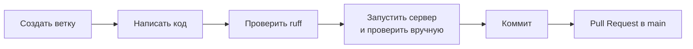

# Руководство разработчика

## Содержание

- [Настройка окружения](#настройка-окружения)
- [Процесс разработки](#процесс-разработки)
- [Стиль кода](#стиль-кода)
- [Добавление новой фичи](#добавление-новой-фичи)
- [Полезные команды](#полезные-команды)

---

## Настройка окружения

```bash
# Клонировать и перейти в директорию
git clone <repository-url>
cd TasKanLine/server

# Установить зависимости (включая dev: ruff, ty)
uv sync

# Создать .env
cp .env.example .env
# Заполнить DB__* и CORE__JWT_SECRET_KEY

# Применить миграции
uv run alembic upgrade head

# Запустить сервер с hot reload
make dev
```

## Процесс разработки


```mermaid
flowchart LR
    A[Создать ветку] --> B[Написать код]
    B --> C[Проверить ruff]
    C --> D[Запустить сервер\nи проверить вручную]
    D --> E[Коммит]
    E --> F[Pull Request в main]
```

Соглашения по именованию веток:
- `feature/<описание>` — новая функциональность
- `fix/<описание>` — исправление бага
- `refactor/<описание>` — рефакторинг
- `docs/<описание>` — документация

Стиль коммитов (Conventional Commits):
```bash
git commit -m "feat: добавить эндпоинт назначения задачи"
git commit -m "fix: исправить 500 при пустом assignee_id"
git commit -m "refactor: вынести _get_current_user_id в depends"
git commit -m "docs: обновить usage.md"
```

## Стиль кода

Линтер и форматтер — **Ruff** (конфигурация по умолчанию):

```bash
# Проверить
uv run ruff check src/

# Исправить автоматически
uv run ruff check --fix src/

# Форматировать
uv run ruff format src/
```

Проверка типов — **ty**:
```bash
uv run ty check src/
```

Основные соглашения:
- Все функции с типами (`def foo(x: int) -> str`)
- Асинхронные функции для всех операций с БД
- Сессия БД только через `AsyncSessionDep`
- JWT-пользователь только через `SecurityDep`
- Транзакции через `async with session.begin()` для write-операций

## Добавление новой фичи

Пример: добавить сущность `Label` (метка для задачи).

**1. Модель** — `src/models/tasks.py`:
```python
class Label(Base):
    __tablename__ = "labels"
    id: Mapped[int] = mapped_column(primary_key=True)
    task_id: Mapped[int] = mapped_column(ForeignKey("tasks.id", ondelete="CASCADE"))
    name: Mapped[str] = mapped_column(String(50))
    color: Mapped[str] = mapped_column(String(7))  # hex color
```

**2. Импорт модели** — добавить в `src/models/__init__.py`:
```python
from .tasks import Label  # noqa: F401
```

**3. Схемы** — `src/schemas/tasks.py`:
```python
class LabelCreate(BaseModel):
    name: str = Field(..., max_length=50)
    color: str = Field(..., pattern="^#[0-9a-fA-F]{6}$")

class LabelResponse(BaseModel):
    id: int
    task_id: int
    name: str
    color: str
    model_config = {"from_attributes": True}
```

**4. CRUD** — `src/crud/tasks.py`:
```python
async def create_label(session: AsyncSession, task_id: int, data: LabelCreate) -> Label:
    label = Label(task_id=task_id, **data.model_dump())
    session.add(label)
    await session.flush()
    return label
```

**5. Роутер** — `src/api/v1/labels.py` (новый файл):
```python
router = APIRouter(tags=["labels"])

@router.post("/tasks/{task_id}/labels", response_model=LabelResponse, status_code=201)
async def create_label(task_id: int, session: AsyncSessionDep, user: SecurityDep, data: LabelCreate):
    ...
```

**6. Регистрация** — `src/api/v1/__init__.py`:
```python
from . import labels
router.include_router(labels.router)
```

**7. Миграция**:
```bash
uv run alembic revision --autogenerate -m "add labels table"
uv run alembic upgrade head
```

## Полезные команды

| Команда                                      | Описание                                  |
|----------------------------------------------|-------------------------------------------|
| `make dev`                                   | Запуск сервера с hot reload               |
| `make build`                                 | Собрать Docker-образ                      |
| `make build-run`                             | Собрать и запустить Docker-контейнер      |
| `make stop`                                  | Остановить контейнер                      |
| `make clean`                                 | Удалить контейнер и образ                 |
| `uv add <package>`                           | Добавить зависимость                      |
| `uv pip freeze > requirements.txt`           | Обновить requirements.txt для Docker      |
| `uv run alembic upgrade head`                | Применить миграции                        |
| `uv run alembic revision --autogenerate -m`  | Создать новую миграцию                    |
| `uv run ruff check src/`                     | Проверить стиль кода                      |
| `uv run ruff format src/`                    | Форматировать код                         |
| `uv run ty check src/`                       | Проверить типы                            |
