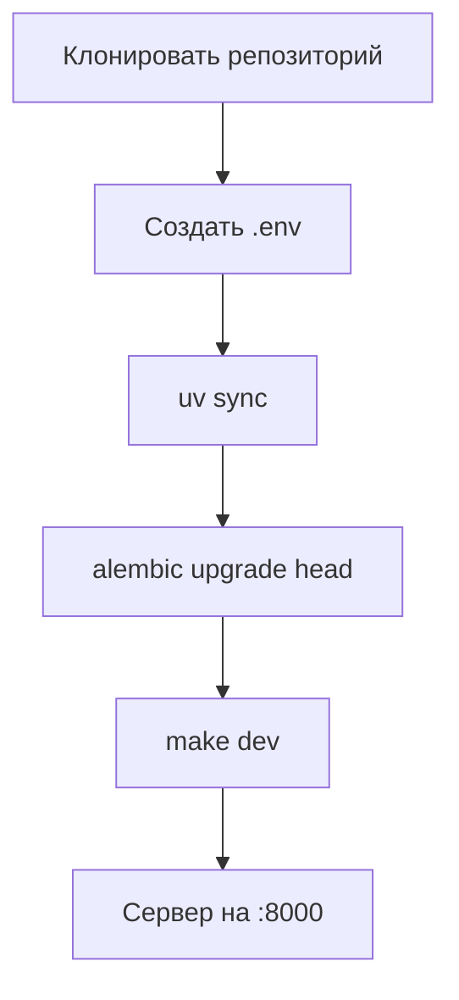

# Установка и настройка

## Содержание

- [Требования](#требования)
- [Локальная разработка](#локальная-разработка)
- [Docker](#docker)
- [Переменные окружения](#переменные-окружения)
- [Миграции базы данных](#миграции-базы-данных)
- [Проверка работоспособности](#проверка-работоспособности)
- [Типичные проблемы](#типичные-проблемы)

---

## Требования

| Компонент  | Версия  | Назначение                        |
|------------|---------|-----------------------------------|
| Python     | 3.13+   | Рантайм                           |
| PostgreSQL | 15+     | База данных                       |
| uv         | любая   | Менеджер зависимостей (локально)  |
| Docker     | 20.10+  | Контейнерный запуск               |

Установить `uv`:
```bash
curl -LsSf https://astral.sh/uv/install.sh | sh
```

## Локальная разработка



Шаги:

```bash
# 1. Клонировать
git clone <repository-url>
cd TasKanLine/server

# 2. Создать файл переменных окружения
cp .env.example .env
# Отредактировать .env: параметры PostgreSQL и JWT_SECRET_KEY

# 3. Установить зависимости и запустить сервер (hot reload)
make dev
# Эквивалентно: uv sync && uv run src/main.py

# 4. Применить миграции (в отдельном терминале)
uv run alembic upgrade head
```

## Docker

Проект собирается в образ `backend-taskanline` на базе `python:3.13-slim`. В `docker-compose.yml` описан один сервис `taskanline_server`, подключённый к двум внешним сетям (`taskanline-server-network`, `taskanline-client-network`).

```bash
# Сгенерировать requirements.txt и собрать образ
make build

# Запустить контейнер (порт 8000)
make run

# Сборка + запуск одной командой
make build-run

# Управление контейнером
make start    # запустить остановленный
make stop     # остановить
make clean    # удалить контейнер и образ

# Полное обновление: git pull + пересборка + запуск
make update-app
```

Запуск через Docker Compose (требует внешних сетей):
```bash
# Создать внешние сети (один раз)
docker network create taskanline-server-network
docker network create taskanline-client-network

# Запустить
docker compose up -d
```

## Переменные окружения

Файл `.env` (создаётся из `.env.example`):

| Переменная              | Описание                                  | Обязательная | Пример                         |
|-------------------------|-------------------------------------------|:------------:|--------------------------------|
| `CORE__HOST`            | Хост для запуска сервера                  | да           | `0.0.0.0`                      |
| `CORE__PORT`            | Порт сервера                              | да           | `8000`                         |
| `CORE__ALLOWED_ORIGINS` | Список CORS-источников (JSON-массив)      | да           | `["http://localhost:3000"]`    |
| `CORE__JWT_SECRET_KEY`  | Секретный ключ для подписи JWT            | да           | случайная строка               |
| `DB__HOST`              | Хост PostgreSQL                           | да           | `localhost`                    |
| `DB__PORT`              | Порт PostgreSQL                           | да           | `5432`                         |
| `DB__USER`              | Пользователь PostgreSQL                   | да           | `postgres`                     |
| `DB__PASSWORD`          | Пароль PostgreSQL                         | да           | —                              |
| `DB__DATABASE`          | Имя базы данных                           | да           | `taskanline`                   |

Настройки читаются через Pydantic Settings с разделителем `__` для вложенных групп (`CORE__*` → `settings.core`, `DB__*` → `settings.db`).

Сгенерировать JWT-секрет:
```bash
python -c "import secrets; print(secrets.token_urlsafe(32))"
```

## Миграции базы данных

```bash
# Применить все миграции
uv run alembic upgrade head

# Создать новую миграцию (после изменения моделей)
uv run alembic revision --autogenerate -m "краткое описание"

# Применить созданную миграцию
uv run alembic upgrade head

# Откатить последнюю миграцию
uv run alembic downgrade -1

# Посмотреть текущее состояние
uv run alembic current
```

Alembic настроен в `alembic.ini` и `migrations/env.py`. URL базы данных берётся автоматически из `settings.db.url()`. Все модели импортируются в `migrations/env.py` через `src.models.*` — не забывайте добавлять новые модели туда же.

## Проверка работоспособности

```bash
# Корневой эндпоинт — должен вернуть {"message": "Hello World"}
curl http://localhost:8000/

# Swagger UI
open http://localhost:8000/docs

# Состояние Docker-контейнера
docker ps
docker logs some-backend-taskanline
```

## Типичные проблемы

**`connection refused` к PostgreSQL**
- Убедитесь, что PostgreSQL запущен: `systemctl status postgresql`
- Проверьте параметры `DB__*` в `.env`

**`ModuleNotFoundError` при запуске**
- Запускайте через `uv run src/main.py`, а не напрямую `python src/main.py`
- Или активируйте виртуальное окружение: `source .venv/bin/activate`

**Порт 8000 уже занят**
```bash
lsof -i :8000
# Поменять порт: CORE__PORT=8001 в .env
```

**Ошибки автогенерации миграций Alembic**
- Проверьте, что новая модель импортирована в `migrations/env.py`
- Проверьте подключение: `uv run alembic current`
