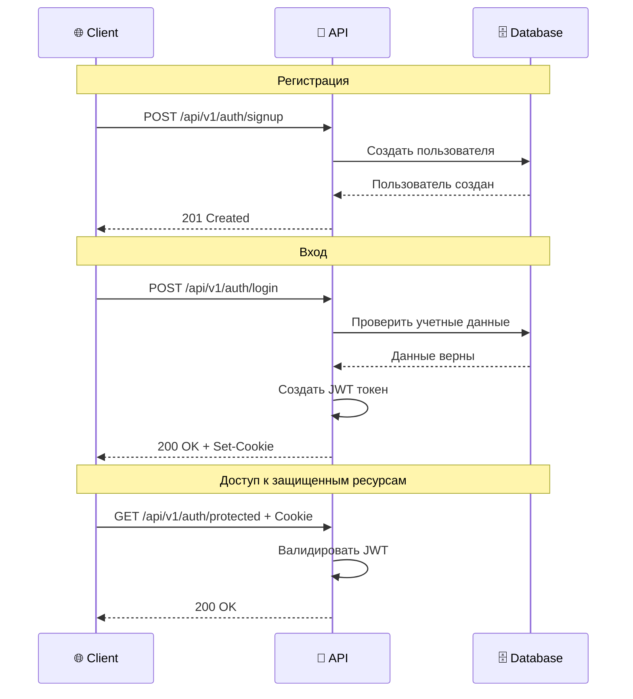

# 💡 Использование API

## 🌐 Обзор API

**TasKanLine Backend** предоставляет RESTful API для управления пользователями и аутентификацией. API построен на FastAPI с автоматической документацией Swagger/OpenAPI.

### 📋 Базовая информация

- **Базовый URL**: `http://localhost:8000`
- **API версия**: `v1`
- **Формат данных**: JSON
- **Аутентификация**: JWT через cookies
- **Документация**: `/docs` (Swagger), `/redoc` (ReDoc)

### 🔗 Эндпоинты API

| Метод | Эндпоинт | Описание | Аутентификация |
|-------|----------|----------|----------------|
| `GET` | `/` | Здоровье сервера | ❌ Нет |
| `POST` | `/api/v1/auth/signup` | Регистрация пользователя | ❌ Нет |
| `POST` | `/api/v1/auth/login` | Вход пользователя | ❌ Нет |
| `GET` | `/api/v1/auth/protected` | Защищенный эндпоинт | ✅ Да |
| `GET` | `/api/v1/auth/me` | Информация о текущем пользователе | ✅ Да |

## 🔐 Аутентификация

### 🍪 Cookie-based JWT

Проект использует JWT токены, передаваемые через HTTP cookies для безопасности.

#### 🔄 Процесс аутентификации



### 📝 Примеры аутентификации

#### 🆝 Регистрация нового пользователя

```bash
curl -X POST "http://localhost:8000/api/v1/auth/signup" \
  -H "Content-Type: application/json" \
  -d '{
    "email": "user@example.com",
    "password": "SecurePassword123!"
  }'
```

**Ответ:**
```json
{
  "message": "User created successfully",
  "user_id": "123e4567-e89b-12d3-a456-426614174000"
}
```

#### 🔑 Вход пользователя

```bash
curl -X POST "http://localhost:8000/api/v1/auth/login" \
  -H "Content-Type: application/json" \
  -d '{
    "email": "user@example.com",
    "password": "SecurePassword123!"
  }' \
  -c cookies.txt
```

**Ответ:**
```json
{
  "message": "Login successful",
  "access_token": "eyJ0eXAiOiJKV1QiLCJhbGciOiJIUzI1NiJ9...",
  "token_type": "bearer"
}
```

#### 🛡️ Доступ к защищенному эндпоинту

```bash
curl -X GET "http://localhost:8000/api/v1/auth/protected" \
  -b cookies.txt
```

**Ответ:**
```json
{
  "message": "Welcome to the protected endpoint!",
  "user_id": "123e4567-e89b-12d3-a456-426614174000"
}
```

## 📊 Модели данных

### 👤 User Model

```json
{
  "id": "uuid",
  "email": "user@example.com",
  "hashed_password": "argon2_hash",
  "is_active": true,
  "created_at": "2024-01-01T00:00:00Z",
  "updated_at": "2024-01-01T00:00:00Z"
}
```

### 📝 User Profile Model

```json
{
  "id": "uuid",
  "user_id": "uuid",
  "first_name": "John",
  "last_name": "Doe",
  "avatar_url": "https://example.com/avatar.jpg",
  "bio": "Software Developer",
  "created_at": "2024-01-01T00:00:00Z",
  "updated_at": "2024-01-01T00:00:00Z"
}
```

## 🔍 Pydantic Схемы

### 📋 Схемы запросов

#### 🆕 UserCreate (Регистрация)

```python
class UserCreate(BaseModel):
    email: EmailStr
    password: str = Field(..., min_length=8, max_length=128)
    
    @validator('password')
    def validate_password(cls, v):
        if not re.match(r'^(?=.*[a-z])(?=.*[A-Z])(?=.*\d)(?=.*[@$!%*?&])[A-Za-z\d@$!%*?&]', v):
            raise ValueError('Password must contain at least one uppercase letter, one lowercase letter, one digit, and one special character')
        return v
```

#### 🔐 UserLogin (Вход)

```python
class UserLogin(BaseModel):
    email: EmailStr
    password: str
```

### 📤 Схемы ответов

#### 👤 UserResponse

```python
class UserResponse(BaseModel):
    id: UUID
    email: str
    is_active: bool
    created_at: datetime
    
    class Config:
        from_attributes = True
```

#### 🎉 AuthResponse

```python
class AuthResponse(BaseModel):
    message: str
    access_token: str
    token_type: str = "bearer"
    user: UserResponse
```

## 🛠️ Примеры использования

### 💻 Python примеры

#### 🐍 Использование с requests

```python
import requests

# Базовый URL
BASE_URL = "http://localhost:8000"

# Регистрация
def signup_user(email: str, password: str):
    response = requests.post(
        f"{BASE_URL}/api/v1/auth/signup",
        json={"email": email, "password": password}
    )
    return response.json()

# Вход
def login_user(email: str, password: str):
    response = requests.post(
        f"{BASE_URL}/api/v1/auth/login",
        json={"email": email, "password": password}
    )
    return response.json(), response.cookies

# Доступ к защищенному ресурсу
def get_protected_data(cookies):
    response = requests.get(
        f"{BASE_URL}/api/v1/auth/protected",
        cookies=cookies
    )
    return response.json()

# Использование
if __name__ == "__main__":
    # Регистрация
    signup_result = signup_user("test@example.com", "SecurePass123!")
    print("Signup:", signup_result)
    
    # Вход
    login_result, cookies = login_user("test@example.com", "SecurePass123!")
    print("Login:", login_result)
    
    # Доступ к защищенным данным
    protected_data = get_protected_data(cookies)
    print("Protected:", protected_data)
```

#### 🐍 Использование с httpx (асинхронный)

```python
import httpx
import asyncio

async def async_auth_example():
    async with httpx.AsyncClient() as client:
        # Регистрация
        signup_response = await client.post(
            f"{BASE_URL}/api/v1/auth/signup",
            json={"email": "async@example.com", "password": "SecurePass123!"}
        )
        print("Signup:", signup_response.json())
        
        # Вход
        login_response = await client.post(
            f"{BASE_URL}/api/v1/auth/login",
            json={"email": "async@example.com", "password": "SecurePass123!"}
        )
        
        # Доступ к защищенному ресурсу
        protected_response = await client.get(
            f"{BASE_URL}/api/v1/auth/protected",
            cookies=login_response.cookies
        )
        print("Protected:", protected_response.json())

# Запуск
asyncio.run(async_auth_example())
```

### 🌐 JavaScript примеры

#### 📱 Использование с fetch

```javascript
// Базовый URL
const BASE_URL = 'http://localhost:8000';

// Регистрация
async function signup(email, password) {
  const response = await fetch(`${BASE_URL}/api/v1/auth/signup`, {
    method: 'POST',
    headers: {
      'Content-Type': 'application/json',
    },
    body: JSON.stringify({ email, password }),
    credentials: 'include'
  });
  return await response.json();
}

// Вход
async function login(email, password) {
  const response = await fetch(`${BASE_URL}/api/v1/auth/login`, {
    method: 'POST',
    headers: {
      'Content-Type': 'application/json',
    },
    body: JSON.stringify({ email, password }),
    credentials: 'include'
  });
  return await response.json();
}

// Доступ к защищенному ресурсу
async function getProtectedData() {
  const response = await fetch(`${BASE_URL}/api/v1/auth/protected`, {
    method: 'GET',
    credentials: 'include'
  });
  return await response.json();
}

// Использование
(async () => {
  try {
    // Регистрация
    const signupResult = await signup('js@example.com', 'SecurePass123!');
    console.log('Signup:', signupResult);
    
    // Вход
    const loginResult = await login('js@example.com', 'SecurePass123!');
    console.log('Login:', loginResult);
    
    // Доступ к защищенным данным
    const protectedData = await getProtectedData();
    console.log('Protected:', protectedData);
  } catch (error) {
    console.error('Error:', error);
  }
})();
```

#### 📦 Использование с Axios

```javascript
import axios from 'axios';

// Создание экземпляра с поддержкой cookies
const api = axios.create({
  baseURL: 'http://localhost:8000',
  withCredentials: true
});

// Регистрация
const signup = async (email, password) => {
  try {
    const response = await api.post('/api/v1/auth/signup', {
      email,
      password
    });
    return response.data;
  } catch (error) {
    console.error('Signup error:', error.response.data);
    throw error;
  }
};

// Вход
const login = async (email, password) => {
  try {
    const response = await api.post('/api/v1/auth/login', {
      email,
      password
    });
    return response.data;
  } catch (error) {
    console.error('Login error:', error.response.data);
    throw error;
  }
};

// Доступ к защищенному ресурсу
const getProtectedData = async () => {
  try {
    const response = await api.get('/api/v1/auth/protected');
    return response.data;
  } catch (error) {
    console.error('Protected data error:', error.response.data);
    throw error;
  }
};

// Использование
const main = async () => {
  try {
    await signup('axios@example.com', 'SecurePass123!');
    await login('axios@example.com', 'SecurePass123!');
    const data = await getProtectedData();
    console.log('Protected data:', data);
  } catch (error) {
    console.error('Error:', error);
  }
};

main();
```

## 🧪 Тестирование API

### 📋 Postman коллекция

Вы можете импортировать следующую коллекцию в Postman:

```json
{
  "info": {
    "name": "TasKanLine API",
    "description": "API для управления задачами"
  },
  "item": [
    {
      "name": "Signup",
      "request": {
        "method": "POST",
        "header": [
          {
            "key": "Content-Type",
            "value": "application/json"
          }
        ],
        "body": {
          "mode": "raw",
          "raw": "{\n  \"email\": \"test@example.com\",\n  \"password\": \"SecurePass123!\"\n}"
        },
        "url": {
          "raw": "{{baseUrl}}/api/v1/auth/signup",
          "host": ["{{baseUrl}}"],
          "path": ["api", "v1", "auth", "signup"]
        }
      }
    },
    {
      "name": "Login",
      "request": {
        "method": "POST",
        "header": [
          {
            "key": "Content-Type",
            "value": "application/json"
          }
        ],
        "body": {
          "mode": "raw",
          "raw": "{\n  \"email\": \"test@example.com\",\n  \"password\": \"SecurePass123!\"\n}"
        },
        "url": {
          "raw": "{{baseUrl}}/api/v1/auth/login",
          "host": ["{{baseUrl}}"],
          "path": ["api", "v1", "auth", "login"]
        }
      }
    },
    {
      "name": "Protected",
      "request": {
        "method": "GET",
        "url": {
          "raw": "{{baseUrl}}/api/v1/auth/protected",
          "host": ["{{baseUrl}}"],
          "path": ["api", "v1", "auth", "protected"]
        }
      }
    }
  ],
  "variable": [
    {
      "key": "baseUrl",
      "value": "http://localhost:8000"
    }
  ]
}
```

### 🧪 Unit тесты

Пример тестирования эндпоинтов:

```python
import pytest
from httpx import AsyncClient

@pytest.mark.asyncio
async def test_signup():
    async with AsyncClient(base_url="http://localhost:8000") as client:
        response = await client.post(
            "/api/v1/auth/signup",
            json={"email": "test@example.com", "password": "SecurePass123!"}
        )
        assert response.status_code == 201
        assert "user_id" in response.json()

@pytest.mark.asyncio
async def test_login():
    async with AsyncClient(base_url="http://localhost:8000") as client:
        # Сначала регистрируем пользователя
        await client.post(
            "/api/v1/auth/signup",
            json={"email": "test@example.com", "password": "SecurePass123!"}
        )
        
        # Затем входим
        response = await client.post(
            "/api/v1/auth/login",
            json={"email": "test@example.com", "password": "SecurePass123!"}
        )
        assert response.status_code == 200
        assert "access_token" in response.json()
```

## 🚨 Обработка ошибок

### 📋 Коды ошибок

| Код | Описание | Пример |
|-----|----------|--------|
| `400` | Bad Request | Невалидные данные |
| `401` | Unauthorized | Токен отсутствует или невалиден |
| `403` | Forbidden | Нет прав доступа |
| `404` | Not Found | Ресурс не найден |
| `422` | Unprocessable Entity | Ошибка валидации |
| `500` | Internal Server Error | Ошибка сервера |

### 📝 Формат ошибок

```json
{
  "detail": [
    {
      "loc": ["body", "email"],
      "msg": "field required",
      "type": "value_error.missing"
    }
  ]
}
```

### 🔄 Пример обработки ошибок

```python
import requests
from requests.exceptions import HTTPError

def safe_api_call():
    try:
        response = requests.post(
            "http://localhost:8000/api/v1/auth/login",
            json={"email": "invalid@example.com", "password": "wrong"}
        )
        response.raise_for_status()
        return response.json()
    except HTTPError as e:
        if e.response.status_code == 401:
            print("❌ Неверные учетные данные")
        elif e.response.status_code == 422:
            print("❌ Ошибка валидации:", e.response.json())
        else:
            print(f"❌ Ошибка {e.response.status_code}: {e.response.text}")
    except Exception as e:
        print(f"❌ Неизвестная ошибка: {e}")
```

## 📈 Мониторинг и логирование

### 📊 Health check

```bash
curl http://localhost:8000/
```

**Ответ:**
```json
{
  "status": "healthy",
  "version": "1.0.0",
  "timestamp": "2024-01-01T00:00:00Z"
}
```

### 📝 Просмотр логов

```bash
# Docker контейнер
docker logs taskanline-backend

# Локальный запуск
# Логи выводятся в консоль
```

---

**🎉 Отлично!** Теперь вы знаете, как использовать TasKanLine API. Перейдите к разделу [Вклад в проект](contributing.md) чтобы узнать, как участвовать в разработке! 🚀