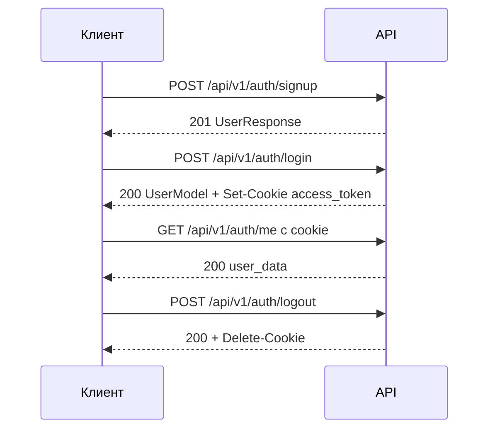

# Использование API

## Содержание

- [Базовая информация](#базовая-информация)
- [Аутентификация](#аутентификация)
- [Проекты](#проекты)
- [Доски](#доски)
- [Колонки](#колонки)
- [Задачи](#задачи)
- [Коды ошибок](#коды-ошибок)

---

## Базовая информация

- Базовый URL: `http://localhost:8000`
- Префикс API: `/api/v1`
- Формат данных: JSON
- Аутентификация: JWT-токен в cookie `access_token` или в заголовке `Authorization: Bearer <token>`
- Интерактивная документация: `http://localhost:8000/docs`

## Аутентификация

### Схема аутентификации


```mermaid
sequenceDiagram
    participant C as Клиент
    participant API as API

    C->>API: POST /api/v1/auth/signup
    API-->>C: 201 UserResponse

    C->>API: POST /api/v1/auth/login
    API-->>C: 200 UserModel + Set-Cookie access_token

    C->>API: GET /api/v1/auth/me с cookie
    API-->>C: 200 user_data

    C->>API: POST /api/v1/auth/logout
    API-->>C: 200 + Delete-Cookie
```

### POST /api/v1/auth/signup — Регистрация

Тело запроса:
```json
{
  "email": "user@example.com",
  "username": "johndoe",
  "first_name": "John",
  "last_name": "Doe",
  "password": "secret123"
}
```

Ответ `201`:
```json
{
  "email": "user@example.com",
  "username": "johndoe",
  "first_name": "John",
  "last_name": "Doe",
  "birth_date": null,
  "phone_number": null,
  "avatar_url": null
}
```

```bash
curl -X POST http://localhost:8000/api/v1/auth/signup \
  -H "Content-Type: application/json" \
  -d '{"email":"user@example.com","username":"johndoe","first_name":"John","last_name":"Doe","password":"secret123"}'
```

### POST /api/v1/auth/login — Вход

Тело запроса:
```json
{
  "email": "user@example.com",
  "password": "secret123"
}
```

Ответ `200` (+ устанавливает cookie `access_token`):
```json
{
  "id": 1,
  "email": "user@example.com",
  "username": "johndoe"
}
```

```bash
curl -X POST http://localhost:8000/api/v1/auth/login \
  -H "Content-Type: application/json" \
  -c cookies.txt \
  -d '{"email":"user@example.com","password":"secret123"}'
```

### GET /api/v1/auth/me — Текущий пользователь

```bash
curl http://localhost:8000/api/v1/auth/me -b cookies.txt
```

Ответ `200`:
```json
{
  "message": "You are authorized",
  "user_data": { "..." : "..." }
}
```

### POST /api/v1/auth/logout — Выход

```bash
curl -X POST http://localhost:8000/api/v1/auth/logout -b cookies.txt
```

Ответ `200`:
```json
{"message": "Successfully logged out"}
```

---

## Проекты

Проект — корневая сущность. Доступны только собственные проекты текущего пользователя.

### POST /api/v1/projects — Создать проект

```bash
curl -X POST http://localhost:8000/api/v1/projects \
  -H "Content-Type: application/json" \
  -b cookies.txt \
  -d '{"name":"Мой проект","description":"Описание"}'
```

Ответ `201`:
```json
{
  "id": 1,
  "name": "Мой проект",
  "description": "Описание",
  "owner_id": 1,
  "created_at": "2026-02-23T10:00:00Z"
}
```

### GET /api/v1/projects — Список проектов

```bash
curl http://localhost:8000/api/v1/projects -b cookies.txt
```

### GET /api/v1/projects/{id} — Получить проект

```bash
curl http://localhost:8000/api/v1/projects/1 -b cookies.txt
```

### DELETE /api/v1/projects/{id} — Удалить проект

Каскадно удаляет все доски, колонки и задачи проекта.

```bash
curl -X DELETE http://localhost:8000/api/v1/projects/1 -b cookies.txt
# 204 No Content
```

---

## Доски

Доска принадлежит проекту. Только владелец проекта может создавать и просматривать доски.

### POST /api/v1/projects/{id}/boards — Создать доску

```bash
curl -X POST http://localhost:8000/api/v1/projects/1/boards \
  -H "Content-Type: application/json" \
  -b cookies.txt \
  -d '{"name":"Спринт 1","description":"Первый спринт"}'
```

Ответ `201`:
```json
{
  "id": 1,
  "project_id": 1,
  "name": "Спринт 1",
  "description": "Первый спринт",
  "created_at": "2026-02-23T10:00:00Z"
}
```

### GET /api/v1/projects/{id}/boards — Список досок проекта

```bash
curl http://localhost:8000/api/v1/projects/1/boards -b cookies.txt
```

### GET /api/v1/boards/{id} — Получить доску

```bash
curl http://localhost:8000/api/v1/boards/1 -b cookies.txt
```

### DELETE /api/v1/boards/{id} — Удалить доску

```bash
curl -X DELETE http://localhost:8000/api/v1/boards/1 -b cookies.txt
# 204 No Content
```

---

## Колонки

Колонка принадлежит доске. Поле `position` задаёт порядок отображения колонок.

### POST /api/v1/boards/{id}/columns — Создать колонку

```bash
curl -X POST http://localhost:8000/api/v1/boards/1/columns \
  -H "Content-Type: application/json" \
  -b cookies.txt \
  -d '{"name":"В работе","position":1}'
```

Ответ `201`:
```json
{
  "id": 1,
  "board_id": 1,
  "name": "В работе",
  "position": 1
}
```

### GET /api/v1/boards/{id}/columns — Список колонок доски

```bash
curl http://localhost:8000/api/v1/boards/1/columns -b cookies.txt
```

### DELETE /api/v1/columns/{id} — Удалить колонку

```bash
curl -X DELETE http://localhost:8000/api/v1/columns/1 -b cookies.txt
# 204 No Content
```

---

## Задачи

Задача принадлежит колонке. Поле `priority` принимает: `low`, `medium`, `high`, `critical`.

### POST /api/v1/columns/{id}/tasks — Создать задачу

```bash
curl -X POST http://localhost:8000/api/v1/columns/1/tasks \
  -H "Content-Type: application/json" \
  -b cookies.txt \
  -d '{
    "title": "Реализовать авторизацию",
    "description": "JWT через cookie",
    "priority": "high",
    "assignee_id": null,
    "due_date": "2026-03-01",
    "position": 0
  }'
```

Ответ `201`:
```json
{
  "id": 1,
  "column_id": 1,
  "creator_id": 1,
  "assignee_id": null,
  "title": "Реализовать авторизацию",
  "description": "JWT через cookie",
  "priority": "high",
  "due_date": "2026-03-01",
  "position": 0,
  "created_at": "2026-02-23T10:00:00Z",
  "updated_at": "2026-02-23T10:00:00Z"
}
```

### GET /api/v1/columns/{id}/tasks — Список задач колонки

```bash
curl http://localhost:8000/api/v1/columns/1/tasks -b cookies.txt
```

### GET /api/v1/tasks/{id} — Получить задачу

```bash
curl http://localhost:8000/api/v1/tasks/1 -b cookies.txt
```

### PATCH /api/v1/tasks/{id} — Обновить задачу

Все поля необязательны — обновляются только переданные.

```bash
curl -X PATCH http://localhost:8000/api/v1/tasks/1 \
  -H "Content-Type: application/json" \
  -b cookies.txt \
  -d '{"priority":"critical","due_date":"2026-02-28"}'
```

### PATCH /api/v1/tasks/{id}/move — Переместить задачу

Переместить задачу в другую колонку или изменить её позицию в текущей.

```bash
curl -X PATCH http://localhost:8000/api/v1/tasks/1/move \
  -H "Content-Type: application/json" \
  -b cookies.txt \
  -d '{"column_id":2,"position":0}'
```

### DELETE /api/v1/tasks/{id} — Удалить задачу

```bash
curl -X DELETE http://localhost:8000/api/v1/tasks/1 -b cookies.txt
# 204 No Content
```

---

## Коды ошибок

| Код | Причина                                         |
|-----|-------------------------------------------------|
| 400 | Обязательное поле не передано                   |
| 401 | Токен отсутствует, невалиден или истёк          |
| 403 | Нет прав (например, чужой проект)               |
| 404 | Ресурс не найден                                |
| 409 | Конфликт (email или username уже существует)    |
| 422 | Ошибка валидации Pydantic (неверный тип/формат) |

Формат ответа об ошибке:
```json
{"detail": "описание ошибки"}
```

Для ошибок валидации (422) — стандартный FastAPI формат:
```json
{
  "detail": [
    {
      "loc": ["body", "email"],
      "msg": "value is not a valid email address",
      "type": "value_error.email"
    }
  ]
}
```
